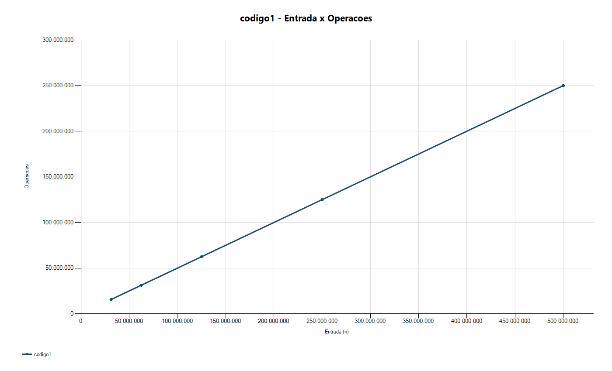
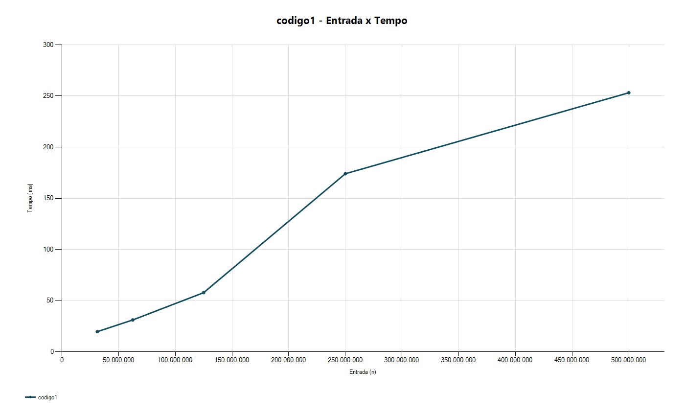
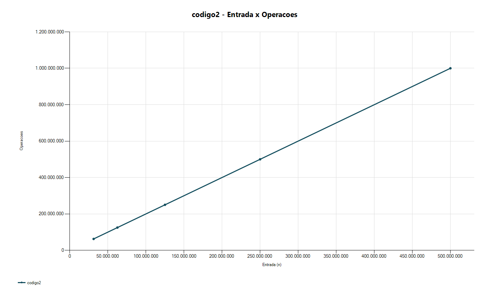
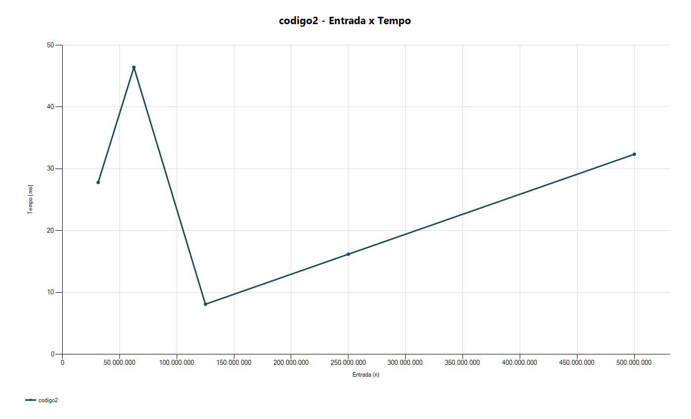
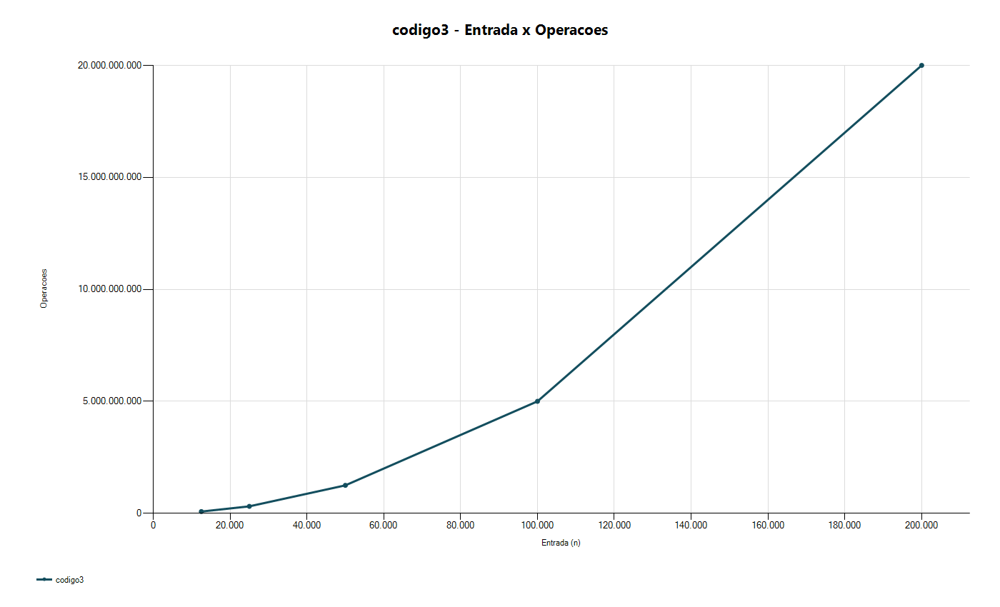
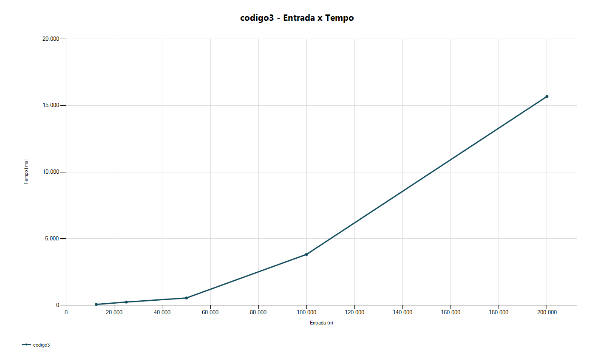
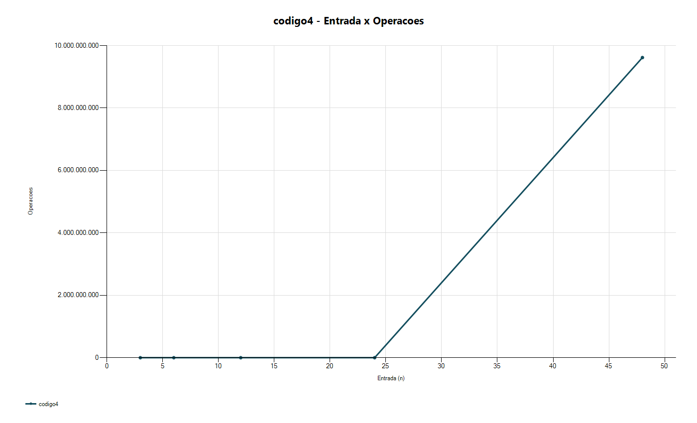
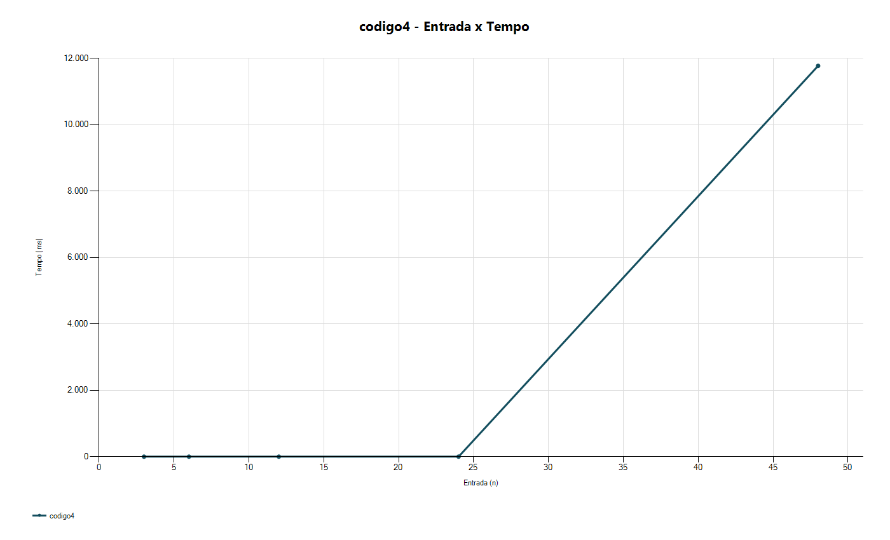

# Análise de desempenho

## Resultados coletados

Os dados brutos utilizados na análise estão em:

- `doc/resultados/codigo1.csv`
- `doc/resultados/codigo2.csv`
- `doc/resultados/codigo3.csv`
- `doc/resultados/codigo4.csv`
- `doc/resultados/resultados-consolidados.csv`

## Gráficos gerados

Os gráficos foram gerados a partir dos CSVs e salvos em `doc/resultados/graficos/`:

- `codigo1`: [operações](resultados/graficos/codigo1-operacoes.png) e [tempo](resultados/graficos/codigo1-tempo.png)
- `codigo2`: [operações](resultados/graficos/codigo2-operacoes.png) e [tempo](resultados/graficos/codigo2-tempo.png)
- `codigo3`: [operações](resultados/graficos/codigo3-operacoes.png) e [tempo](resultados/graficos/codigo3-tempo.png)
- `codigo4`: [operações](resultados/graficos/codigo4-operacoes.png) e [tempo](resultados/graficos/codigo4-tempo.png)

### Código 1

Legenda: crescimento linear. As operações aumentam proporcionalmente a n (aprox. n/2), e o tempo acompanha essa tendência com pequenas oscilações de execução.

### Código 2

Legenda: crescimento linear. Mesmo com laços aninhados, a soma das iterações segue progressão geométrica e resulta em O(n), refletido na curva de operações.

### Código 3

Legenda: crescimento quadrático. Ao dobrar n, as operações tendem a quadruplicar, e o tempo cresce rapidamente, como esperado para O(n²).

### Código 4

Legenda: crescimento exponencial. Pequenos aumentos em n causam grande salto em operações e tempo, evidenciando a inviabilidade prática para entradas maiores.

## Comparação entre operações e tempo

### Código 1

O `codigo1` percorre o vetor de duas em duas posições. Portanto, seu crescimento esperado é linear, com aproximadamente `n / 2` operações relevantes.

Isso aparece nos dados coletados:

- 31.250.000 elementos: 15.625.000 operações
- 62.500.000 elementos: 31.250.000 operações
- 125.000.000 elementos: 62.500.000 operações
- 250.000.000 elementos: 125.000.000 operações
- 500.000.000 elementos: 250.000.000 operações

O tempo de execução cresce de forma geral com o tamanho da entrada, confirmando o comportamento linear. Pequenas variações no tempo são normais por efeitos de cache, escalonamento do sistema operacional e otimizações internas da JVM.

### Código 2

À primeira vista, o `codigo2` parece ter dois laços aninhados, mas o valor de `k` é reduzido pela metade a cada iteração externa. Assim, o total de iterações do laço interno forma uma progressão geométrica:

`n + n/2 + n/4 + ... < 2n`

Logo, o crescimento esperado também é linear, isto é, `O(n)`.

Os resultados confirmam isso:

- 31.250.000 elementos: 62.500.007 operações
- 62.500.000 elementos: 125.000.007 operações
- 125.000.000 elementos: 250.000.007 operações
- 250.000.000 elementos: 500.000.007 operações
- 500.000.000 elementos: 1.000.000.007 operações

Apesar disso, o tempo não cresce de modo perfeitamente proporcional em todas as medições. Isso acontece porque a operação medida é muito simples, e o custo real de execução é influenciado por aquecimento da JVM, otimização JIT e ruído de medição. Mesmo assim, a tendência geral continua compatível com complexidade linear.

### Código 3

O `codigo3` implementa uma variação do Selection Sort. Para cada posição `i`, ele procura o menor elemento no restante do vetor. O número esperado de comparações é:

`n(n - 1) / 2`

Assim, seu crescimento é quadrático, ou seja, `O(n²)`.

Os resultados observados seguem exatamente esse padrão:

- 12.500 elementos: 78.118.750 operações
- 25.000 elementos: 312.487.500 operações
- 50.000 elementos: 1.249.975.000 operações
- 100.000 elementos: 4.999.950.000 operações
- 200.000 elementos: 19.999.900.000 operações

O tempo cresce muito mais rapidamente do que nos algoritmos anteriores. Ao dobrar o tamanho da entrada, a quantidade de operações fica aproximadamente quatro vezes maior, o que é o comportamento típico de algoritmos quadráticos.

### Código 4

O `codigo4` é recursivo e segue a mesma estrutura do cálculo ingênuo da sequência de Fibonacci. Cada chamada gera outras duas chamadas, exceto nos casos-base. Isso produz crescimento exponencial.

Os resultados confirmam esse comportamento:

- n = 3: 3 operações
- n = 6: 15 operações
- n = 12: 287 operações
- n = 24: 92.735 operações
- n = 48: 9.615.053.951 operações

O salto no tempo entre `n = 24` e `n = 48` é extremamente grande, o que mostra de forma clara a inviabilidade prática de algoritmos exponenciais mesmo para entradas relativamente pequenas.

## Conclusão

Os gráficos de operações e tempo devem mostrar a seguinte relação:

- `codigo1`: crescimento linear
- `codigo2`: crescimento linear
- `codigo3`: crescimento quadrático
- `codigo4`: crescimento exponencial

Comparando teoria e prática, os dados observados estão de acordo com o desempenho esperado de cada algoritmo. A principal diferença entre contagem de operações e tempo medido está nas constantes ocultas e nos efeitos do ambiente de execução, especialmente na JVM. Ainda assim, a tendência geral dos tempos acompanha corretamente a ordem de crescimento prevista pela análise assintótica.

## Como montar os gráficos na planilha

Para cada algoritmo, importe o respectivo arquivo CSV e crie dois gráficos usando a coluna `entrada` como eixo horizontal:

1. gráfico de `operacoes`
2. gráfico de `tempo_ms`

Isso permite comparar visualmente o crescimento teórico com o comportamento medido em execução real.